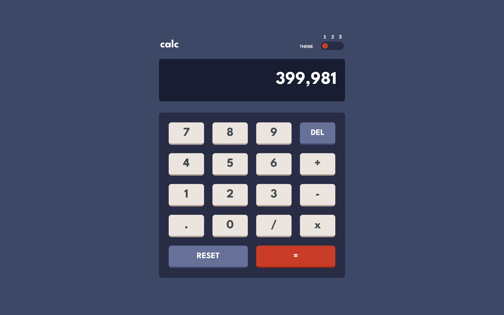

# Frontend Mentor - Calculator app solution

This is a solution to the [Calculator app challenge on Frontend Mentor](https://www.frontendmentor.io/challenges/calculator-app-9lteq5N29). Frontend Mentor challenges help you improve your coding skills by building realistic projects. 

## Table of contents

- [Overview](#overview)
  - [The challenge](#the-challenge)
  - [Screenshot](#screenshot)
  - [Links](#links)
- [My process](#my-process)
  - [Built with](#built-with)
  - [What I learned](#what-i-learned)
- [Author](#author)

## Overview

### The challenge

Users should be able to:

- See the size of the elements adjust based on their device's screen size
- Perform mathmatical operations like addition, subtraction, multiplication, and division
- Adjust the color theme based on their preference
- **Bonus**: Have their initial theme preference checked using `prefers-color-scheme` and have any additional changes saved in the browser

### Screenshot

### Links

- Solution URL: [Github](https://github.com/Absynthee/calculator-app-main)
- Live Site URL: [Github Pages](https://absynthee.github.io/calculator-app-main/)

## My process

### Built with

- Semantic HTML5 markup
- CSS custom properties
- CSS Grid
- [React](https://reactjs.org/) - JS library
- Typescript

### What I learned

This was my first project with React and TypeScript so I learnt a lot about the process, how to build the project, lots about React, and how to deploy to Github pages. It wasn't as intuative as I thought it might be. 

I enjoyed the process and the styling was fun! The toggle switch between themes is very satisfying.

## Author

- Website Design - [KittyCode Creative](https://www.kittycodecreative.com)
- Portfolio - [Austin Spillman](https://www.austinspillman.com)
- Frontend Mentor - [@Absynthee](https://www.frontendmentor.io/profile/Absynthee)
